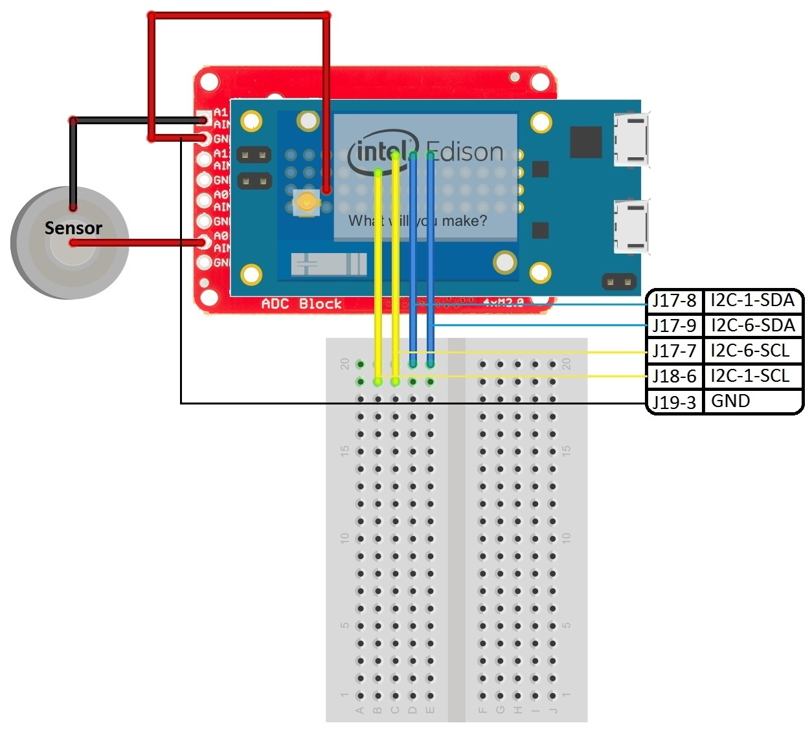

Intel Edison Sparkfun ADC MCU Function
===================

[Back To Main](../README.md)

Index
=================

  * [Description](#description)
  * [References](#references)
  * [Setting Up](#setting-up)
  * [Information](#information)
  * [The code](#the-code)
  * [Comments](#comments)
  * [LICENSE](#license)

Description
=================
This function will read the values from the ADC and send them to the Atom through the **/dev/ttymcu01** file
Be careful to follow these steps and diagrams to setup your board correctly

References
=================
> - If you want to know more about the Intel Edison MCU Quark processor, you can go to this site and learn more about it: [Microcontroller MCU Setup Guide](https://software.intel.com/en-us/creating-applications-with-mcu-sdk-for-intel-edison-board)

Setting Up
=================
Follow this diagram to make the right connections:


Information
=================
Follow These steps:
> - Once you have setup the Eclipse IDE to program your MCU and make sure it works, paste the code provided **mcu_ADC.c** in a new MCU project
> - Make sure to save the project before proceeding 
> - Go to **Project>Clean** and clean all
> - Go to **MCU>Build Project**
> - Go to **MCU>Download**
> - Now all you have to do is run the Script provided **setup_I2C_MCU.sh** and it will just **cat dev/ttymcu0** this file in order to see what is being sent from the MCU coming from the ADC
> - To run the script do as follows:

```
chmod +x setup_I2C_MCU.sh
./setup_I2C_MCU.sh
```

The Code
=================
> - The Function **ADC_read()** returns the value read by the ADC according to the configuration set, it returns an int with the value read scalated 
> - The value read is sent to the Atom using the file **/dev/ttymcu0**

Comments
=================
> - Make sure that the MCU IDE is working with your board correctly before you try this code.
> - This sample code will work for this configuration, if you want to use different configurations for the ADC inputs, you can just change this command **"i2cset -y 1 0x48 1 0xe312 w"** 
> - Specifically you need to change the **0xe312** part
> - If you need some help to change the command to the desired configuration, go to the  [Python Folder](../Python/README.md) to get some help.
> - If you read the ADC while the MCU is communicating with it, you will get some **Reading Errors**, so make sure that you are only using it with either the Atom or the MCU, never at the same time.

LICENSE
=================

Copyright (c) 2014, Intel Corporation

Redistribution and use in source and binary forms, with or without modification,
are permitted provided that the following conditions are met:

* Redistributions of source code must retain the above copyright notice,
  this list of conditions and the following disclaimer.
* Redistributions in binary form must reproduce the above copyright notice,
  this list of conditions and the following disclaimer in the documentation
  and/or other materials provided with the distribution.
* Neither the name of Intel Corporation nor the names of its contributors
  may be used to endorse or promote products derived from this software
  without specific prior written permission.

THIS SOFTWARE IS PROVIDED BY THE COPYRIGHT HOLDERS AND CONTRIBUTORS "AS IS" AND
ANY EXPRESS OR IMPLIED WARRANTIES, INCLUDING, BUT NOT LIMITED TO, THE IMPLIED
WARRANTIES OF MERCHANTABILITY AND FITNESS FOR A PARTICULAR PURPOSE ARE
DISCLAIMED. IN NO EVENT SHALL THE COPYRIGHT OWNER OR CONTRIBUTORS BE LIABLE FOR
ANY DIRECT, INDIRECT, INCIDENTAL, SPECIAL, EXEMPLARY, OR CONSEQUENTIAL DAMAGES
(INCLUDING, BUT NOT LIMITED TO, PROCUREMENT OF SUBSTITUTE GOODS OR SERVICES;
LOSS OF USE, DATA, OR PROFITS; OR BUSINESS INTERRUPTION) HOWEVER CAUSED AND ON
ANY THEORY OF LIABILITY, WHETHER IN CONTRACT, STRICT LIABILITY, OR TORT
(INCLUDING NEGLIGENCE OR OTHERWISE) ARISING IN ANY WAY OUT OF THE USE OF THIS
SOFTWARE, EVEN IF ADVISED OF THE POSSIBILITY OF SUCH DAMAGE.


[Back To Top](#intel-edison-sparkfun-adc-mcu-function)
